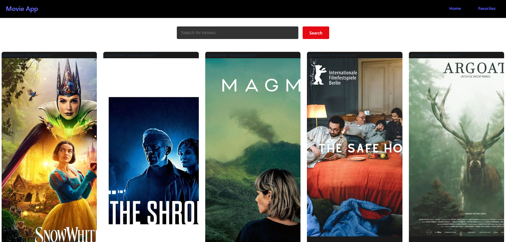
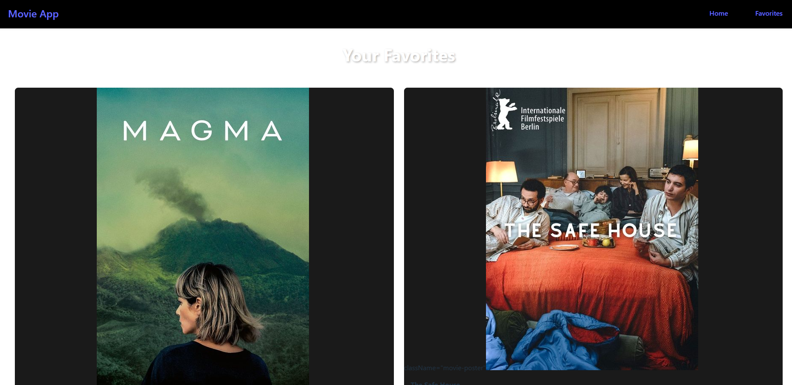

This is a small project I did to revise some core React concepts

### App overview
This app is a dynamic movie search engine built with React that connects to a publicly available API to fetch and display movie data. It allows you to explore popular movies, search for specific titles, and mark your favorite films by hovering over them and clicking a heart icon. Your favorite selections are stored and can be accessed anytime on a dedicated favorites page, where you also have the option to remove movies from your list. This app goes beyond the basics of React by integrating API fetching, state management, and interactive UI elements to enhance the user experience. With a seamless and intuitive design, it provides an engaging way to browse and save favorite films while offering a strong learning experience in working with APIs, managing user state, and building modern web applications.

